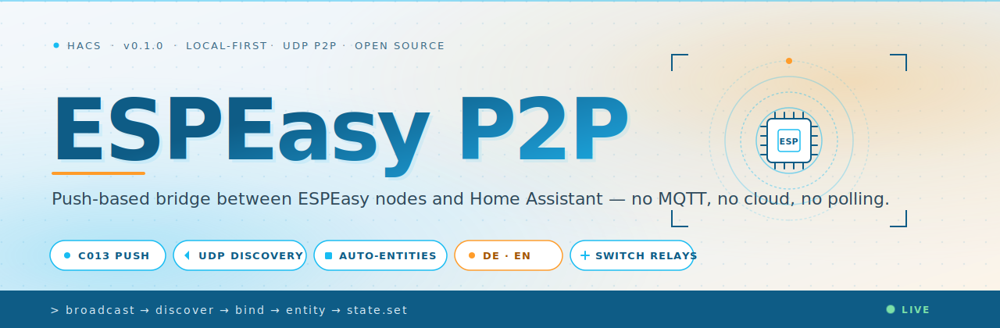

<div align="center">



# 📡 ESPEasy & RPiEasy P2P for Home Assistant

**Push-based, local-first bridge between ESPEasy & RPiEasy nodes and Home Assistant — no MQTT, no cloud, no polling.**

Drop your ESP8266/ESP32 or Raspberry Pi sensors on the LAN, set them to **C013 (ESPEasy/RPiEasy P2P)** controller, and they show up in Home Assistant on their own. Every value is pushed the moment it changes. Every relay can be switched back from Lovelace.

[](https://hacs.xyz/)
[](https://github.com/Chance-Konstruktion/ha-espeasy-p2p/releases)
[](#-license)
[](https://www.home-assistant.io/)
[](https://github.com/letscontrolit/ESPEasy)

**[Quick Start](#-quick-start) · [How it works](#-how-the-data-flows) · [Switching](#-switching-relays) · [Reference](#-reference) · [Troubleshooting](#-troubleshooting)**

</div>

---

## 🤔 Why this exists

> **MQTT is great. Until you don't want to run a broker. Until you don't want to flash credentials. Until you just want a sensor on the wall to show up in Home Assistant — and stay there.**

ESPEasy and RPiEasy already speak **C013** — a tiny UDP broadcast protocol made for ESPEasy/RPiEasy nodes to gossip with each other. This integration teaches Home Assistant to listen on the same wire. That's it. That's the whole trick.

<table>
<tr>
<td align="center" width="33%">

### 🪶 Zero broker
No MQTT, no Mosquitto, no auth headers. Plain UDP on your LAN.

</td>
<td align="center" width="33%">

### ⚡ Push, not poll
Values arrive at HA the moment ESPEasy reads them. Sub-second freshness, no API hammering.

</td>
<td align="center" width="33%">

### 🔌 Plug & forget
Set the controller, save, done. Nodes auto-register. New tasks become new entities.

</td>
</tr>
</table>

---

## ✨ Highlights

<table>
<tr>
<td width="50%">

**📥 Auto-discovery**
New ESPEasy units appear in HA the moment they send their first packet.

</td>
<td width="50%">

**🌡️ All sensor types**
Temperature, humidity, pressure, lux, switches, analog, counters — anything ESPEasy can read.

</td>
</tr>
<tr>
<td>

**🔁 Persistent state**
Last values survive HA restarts. No "unknown" after a reboot.

</td>
<td>

**🎚️ Two-way switching**
Toggle relays, GPIOs and PWM from Lovelace — outgoing C013 packets, just like ESPEasy peers.

</td>
</tr>
<tr>
<td>

**🧭 Unit-aware**
HA picks the right device class and unit (°C, %, hPa, lx) from the ESPEasy plugin ID.

</td>
<td>

**🇩🇪 🇬🇧 Bilingual UI**
Config flow, options, repair issues — fully translated DE + EN.

</td>
</tr>
<tr>
<td>

**🩺 Health watchdog**
Per-node `last_seen` + an `available` sensor. Quiet nodes go `unavailable` automatically.

</td>
<td>

**🪛 HACS-ready**
Drop the repo into HACS, restart, add the integration. No YAML.

</td>
</tr>
</table>

---

## 🧭 How the data flows

```
┌──────────────────┐        UDP :8266        ┌──────────────────────┐
│  ESPEasy node    │  ───── C013 broadcast ──▶│  Home Assistant      │
│  ESP8266/ESP32   │      (sensor frame)     │  espeasy_p2p          │
│  + DHT/BMP/…     │                          │   ├─ discovery        │
└──────────────────┘                          │   ├─ entity registry  │
                                              │   └─ state machine    │
        ▲                                     └──────────┬───────────┘
        │      UDP :8266                                 │
        └────── C013 unicast ◀───── relay / pwm / gpio ──┘
                (switch frame)
```

<details>
<summary><b>What's actually in the packet?</b></summary>

A C013 frame is a small fixed-layout struct with:

- **Header** — protocol version + packet type (`SENSOR_DATA_PACKET` or similar)
- **Source unit** — the ESPEasy unit ID (1–255)
- **Task index** — which task on the node fired this
- **Plugin ID** — DHT, BMP280, switch, analog, …
- **Values 1–4** — up to four `float32` slots per task

`espeasy_p2p` binds each `(unit, task, value-index)` triple to one Home Assistant entity and feeds new floats straight into its state.

</details>

---

## 🚀 Quick Start

### 1 · Install via HACS

```text
HACS → ⋮ → Custom repositories
URL:  https://github.com/Chance-Konstruktion/ha-espeasy-p2p
Type: Integration
```

Then search **"ESPEasy P2P"** in HACS, install, and restart Home Assistant.

### 2 · Add the integration

```text
Settings → Devices & Services → + Add Integration → "ESPEasy P2P"
```

Pick the UDP port (default `8266`) and an optional unit number for HA itself. Confirm.

### 3 · Point your nodes at HA

On every ESPEasy or RPiEasy unit, in **Controllers → Add → ESPEasy P2P (C013)**:

```yaml
Controller IP:   <your Home Assistant IP>
Controller Port: 8266
Unit Number:     <unique 1–255 per node>
Enabled:         ✓
```

Save. Within seconds the device shows up under **Settings → Devices & Services → ESPEasy P2P**.

> 💡 **Non-tech check** — if the ESPEasy *Tools → Log* shows `C013: send to <HA-IP>` and you don't see the device in HA, jump to [Troubleshooting](#-troubleshooting). 9 out of 10 times it's a firewall on the HA host.

---

## 🎚️ Switching relays

Two-way control is supported for tasks that map to writable GPIOs.

<details>
<summary><b>Supported output kinds</b></summary>

| ESPEasy plugin | HA platform | Notes |
| :--- | :--- | :--- |
| GPIO Switch (P001) | `switch` | On/off, retained |
| Relay / Bistable | `switch` | Mirrored locally on the node |
| PWM Output (P019) | `light` (brightness) | 0–1023 mapped to 0–255 |
| GPIO Pulse | `button` | Fires a one-shot C013 frame |

</details>

<details>
<summary><b>How HA → node packets are addressed</b></summary>

When you flip a switch in Lovelace, `espeasy_p2p` sends a **unicast** C013 frame to the node's last-seen IP with the target task index and the new value. The node executes the command locally — no acknowledgement is required because the next sensor broadcast confirms the new state.

If the node is offline, the packet is silently dropped. HA marks the entity `unavailable` after the per-node `last_seen` timeout (default **5 min**).

</details>

<details>
<summary><b>Known limitations</b></summary>

- **No encryption.** C013 is plain UDP — keep it on a trusted VLAN.
- **No retries.** One packet per click. Use HA automations + `last_seen` if you need delivery guarantees.
- **Unit numbers must be unique** across your LAN. Duplicate IDs = entity collisions.

</details>

---

## 📚 Reference

<details>
<summary><b>Entities created per node</b></summary>

| Entity | Type | Source |
| :--- | :--- | :--- |
| `sensor.<name>_<task>_<value>` | `sensor` | each value slot of each task |
| `binary_sensor.<name>_<task>` | `binary_sensor` | switch/PIR tasks |
| `switch.<name>_<task>` | `switch` | writable GPIO tasks |
| `sensor.<name>_last_seen` | `sensor` (timestamp) | per-node watchdog |
| `binary_sensor.<name>_available` | `binary_sensor` | derived from `last_seen` |

</details>

<details>
<summary><b>Services</b></summary>

| Service | Fields | What it does |
| :--- | :--- | :--- |
| `espeasy_p2p.send_command` | `unit`, `task`, `value` | Send a raw C013 command frame |
| `espeasy_p2p.reload_unit` | `unit` | Drop cached entities + rediscover |
| `espeasy_p2p.rename_unit` | `unit`, `new_name` | Persist a friendly name |

</details>

<details>
<summary><b>Configuration options</b></summary>

| Option | Default | Description |
| :--- | :--- | :--- |
| UDP port | `8266` | Must match the controller settings on every node |
| HA unit number | `250` | Unit ID Home Assistant uses in its own announce packets |
| HA peer name | `Home Assistant` | Name HA advertises to the C013 mesh |
| Decimal precision | `3` | Decimal places shown for sensor values (0–6) |

Per-switch GPIO pins and command templates are configured later via the
integration's **Configure** (options) dialog. The stale/offline timeout
(120 s) is fixed.

> **Networking:** the integration receives UDP **broadcasts** on port 8266.
> This only works when Home Assistant can see them on the LAN — i.e. HA OS,
> Supervised, or a container started with **host networking**
> (`--network=host`). In a bridged Docker network broadcasts never arrive and
> no nodes will be discovered.

</details>

---

## 🛠️ Troubleshooting

<details>
<summary><b>❌ No devices show up after I set the controller</b></summary>

1. On the node: **Tools → Log** — do you see `C013: send to <HA-IP>:8266`?
2. On HA host: `sudo ufw status` / firewall — UDP **8266** inbound must be open.
3. Same subnet? C013 broadcasts don't cross routers without a relay.
4. HA log: `Settings → System → Logs` — filter for `espeasy_p2p`.
</details>

<details>
<summary><b>⚠️ Entities exist but values stay at "unknown"</b></summary>

- Plugin ID may be unknown to the integration. Open an issue with the **Devices → device info** screenshot and a log line containing the packet.
- Task values 2–4 are only populated by multi-value plugins (e.g. DHT22 = temp + hum). Single-value plugins leave them empty.
</details>

<details>
<summary><b>🔌 Switching a relay does nothing</b></summary>

- The node's controller must have **Send to controller** enabled and at least one **Controller** entry pointing at HA.
- Confirm the task is bound to a writable GPIO (not a read-only sensor).
- Watch the node log while flipping the switch — you should see a `C013: recv` line.
</details>

<details>
<summary><b>⏱️ A switch flips back / state lags on short intervals</b></summary>

Switch state in HA is confirmed three ways: a C013 **push** from the node
when the value changes, a **30 s `/json` poll** as a safety net, and — right
after HA itself toggles a switch on — a short **targeted re-read burst**
(~3 s / 8 s / 20 s, that one node only). So a relay that auto-switches off a
few seconds later (internal timer/pulse) is caught quickly, with no
steady-state overhead.

The remaining limit: **on/off cycles faster than ~3 s** that HA can't observe
in between may be missed (HA might only ever see one of the two states). For
accurate state on very fast-cycling outputs, make the node **broadcast on
every change** (`Send to controller` so each transition is pushed) rather
than relying on HA to catch it.
</details>

<details>
<summary><b>🌀 Duplicate entities after a unit-number change</b></summary>

Use `espeasy_p2p.reload_unit` or remove the device under **Settings → Devices & Services** and let it rediscover.
</details>

<details>
<summary><b>🗑️ Delete or replace a single node</b></summary>

Every discovered ESPEasy node is its **own device**, not part of one big
integration device. To remove a mis-detected, retired, or replaced node,
open it under **Settings → Devices & Services → ESPEasy P2P**, click the
node device, and choose **Delete** from the three-dot menu — no need to
remove and re-add the whole integration. The `espeasy_p2p.remove_node`
service does the same thing by unit number. A node only comes back if it
sends a fresh heartbeat afterwards, so deleting a retired unit makes it
stay gone.
</details>
</details>

---

## 🤝 Contributing

PRs and issues welcome. Especially:

- **New plugin mappings** — if your sensor's plugin ID isn't recognised, send a packet capture + the ESPEasy plugin name.
- **Translations** — DE and EN are in `translations/`. Add a `xx.json` and open a PR.
- **Tests** — `pytest` lives under `tests/`. Run `pytest -q` before pushing.

```bash
git clone https://github.com/Chance-Konstruktion/ha-espeasy-p2p
cd ha-espeasy-p2p
pip install -r requirements_test.txt
pytest -q
```

---

## 📄 License

MIT © Chance-Konstruktion. See [LICENSE](LICENSE).

---

<div align="center">
<sub>
Built for the corner of Home Assistant where the wires meet the wall.<br/>
ESPEasy is © letscontrolit · Home Assistant is © Nabu Casa · this integration is unaffiliated.
</sub>
</div>
